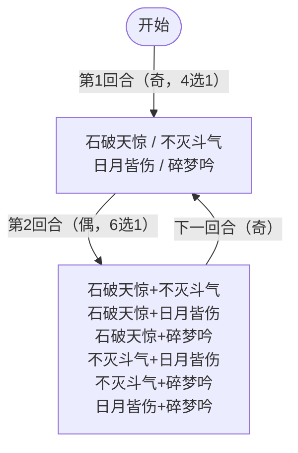

# 盖亚

## 基本信息

| 属性 | 数值 |
|---|---|
| 分类 | [Boss 怪物](/monsters/boss/) |
| 生命值 | 138 - 143 |
| 被动能力 | [返璞归真](#被动能力)（暴击回血）+ [暴击](#被动能力)（12.5% 暴击率）+ [横幅规则](#横幅规则)（开局 3 选 1） |

## 行动逻辑

开局自带返璞归真 + 暴击 + 横幅规则（血/天/邪三选一随机），之后每回合随机出招：奇数回合出 1 个单招，偶数回合出 2 个连招。

> **奇数回合**（4 选 1 等权）：石破天惊 / 不灭斗气 / 日月皆伤 / 碎梦吟；**偶数回合**（6 选 1 等权）双招连招，依次执行两个招式。

- **石破天惊**：16伤害，速度+1，反转敌人全属性提升
- **不灭斗气**：全属性+2，下次攻击必暴击
- **日月皆伤**：12伤害，双倍反弹下次受到的伤害
- **碎梦吟**：3伤害×5次，每次命中施加1层易伤
- **双招组合**：依次执行两个招式，效果与单招一致

## 招式

### 单意图招式

| 招式 | 意图 | 描述 | 数值 |
|---|---|---|---|
| 石破天惊 | 攻击 | 造成 16 点伤害。自身速度 +1，并反转你所有的属性提升 | 伤害 16；速度 +1 |
| 不灭斗气 | 不灭斗气 | 自身全属性 +2，且下次攻击必定造成致命一击 | 全属性 +2 |
| 日月皆伤 | 攻击 | 造成 12 点伤害。将下次受到的伤害双倍反弹给你 | 伤害 12 |
| 碎梦吟 | 多段攻击 | 造成 3 点伤害 5 次。每次伤害施加 1 层易伤 | 3 伤害 × 5 次 |

### 双意图组合招式

依次执行两个单意图招式，效果与单意图完全一致。

| 招式 | 意图 1 | 意图 2 |
|---|---|---|
| 石破天惊·不灭斗气 | 石破天惊 | 不灭斗气 |
| 石破天惊·日月皆伤 | 石破天惊 | 日月皆伤 |
| 石破天惊·碎梦吟 | 石破天惊 | 碎梦吟 |
| 不灭斗气·日月皆伤 | 不灭斗气 | 日月皆伤 |
| 不灭斗气·碎梦吟 | 不灭斗气 | 碎梦吟 |
| 日月皆伤·碎梦吟 | 日月皆伤 | 碎梦吟 |

### 招式细节

- **石破天惊**：反转敌人全属性提升——对力量、防御、命中、速度中 Amount 为正的能力施加 `-2 × Amount`，正值翻号为负值。
- **不灭斗气**：施加力量、防御、命中、速度各 +2，并施加下次攻击必定暴击（攻击后自动移除）。
- **日月皆伤**：造成 12 点伤害，并施加双倍反弹（1 层，反弹后自动递减）。
- **碎梦吟**：先施加"每次命中施加易伤"能力，再造成 3 点伤害 5 次，每次命中给目标 1 层易伤。

## 被动能力

### 返璞归真

自身造成暴击时，恢复等量于该次暴击伤害的生命值。每次命中单独判定（多段攻击每次命中都判定暴击回血）。

- **能力类型**：不可消除（不被消除 buff/debuff 类效果清除）。

### 暴击

攻击时有 12.5% 几率造成暴击，造成 1.5 倍伤害。盖亚开局自带 1 层，是与"返璞归真"联动的内部能力。

## 横幅规则

开局由同步随机数随机选择 3 种规则之一，并在战斗界面顶部常驻显示横幅（淡入动画）。三种规则互斥，均为不可消除。

| 规则 | 名称 | 效果 |
|---|---|---|
| 血 | 血 | 受到的伤害变为 3 倍。第 3 回合起，自身攻击伤害 ×10000（直接处决敌人） |
| 天 | 天 | 受到的非暴击伤害降至 50%；受到的暴击伤害变为 3 倍 |
| 邪 | 邪 | 受到的伤害减少 (50 - 5 × 回合数)%（第 1 回合减伤 45%，逐回合递减 5%，第 10 回合起不减伤） |

## 遭遇战

| 遭遇战 | 房间类型 | 池子 | 数量 | 说明 |
|---|---|---|---|---|
| `SeerGaiaBoss` | Boss | 第一层 | 1 只 | 单怪物 Boss，Boss 节点图标 seer_gaia_boss_icon |
| `SeerEventGaiaRuiersiEncounter` | Monster | 事件遭遇战 | 2 只 | 盖亚 + 斗神瑞尔斯同时出场；无奖励 |

## 攻略要点

### 横幅规则决定战术（开局必看）

开局观察顶部横幅文字，三种规则对应完全不同的战术：

| 规则 | 盖亚受伤 | 盖亚攻击 | 战术建议 |
|---|---|---|---|
| **血** | ×3 倍（极脆） | 第3回合起 ×10000（秒杀） | **必须在3回合内击杀**，玩家有3个玩家回合（回合1、2、3），第3回合盖亚回合开始时激活秒杀 |
| **天** | 非暴击 ×0.5，暴击 ×3 | 正常 | **暴击流最快**，堆暴击率让盖亚承伤3倍；非暴击流伤害减半很难打 |
| **邪** | 第1回合 -45%，逐回合 -5%，第10回合 0% | 正常 | **前期难打后期好打**，盖亚血量低时减伤才降下来，速攻反而不利 |

**血规则最危险**：盖亚受伤3倍看似脆（138-143血打一下变400+血），但第3回合盖亚回合开始时激活攻击×10000必杀。**玩家有3个回合（回合1、2、3）输出窗口**——回合时序为：玩家回合1→盖亚回合1（TurnCount=1）→玩家回合2→盖亚回合2（TurnCount=2）→玩家回合3→盖亚回合3（TurnCount=3，**激活秒杀**）。建议保留爆发牌和能量药水，开局直接全力输出。

**天规则最看 build**：暴击流（暴击率 ≥ 50%）打天规则盖亚伤害3倍非常爽。非暴击流的取舍：
- **攻击伤害流**：非暴击伤害×0.5，输出效率减半，确实很难打。但盖亚血量 138-143 不算高，可通过高伤单次攻击 + 力量累积弥补
- **固定伤害/非攻击伤害流**：不受天规则影响（天规则只修饰受到的攻击伤害倍率，固定伤害/Power伤害/流失伤害不受影响）。可绕过天规则的减伤
- **注意**：天规则下盖亚暴击回血量不会变3倍（回血取决于盖亚造成的伤害，与盖亚受伤倍率无关）

**邪规则最稳**：前期45%减伤看似难打，但盖亚血量138-143不高，第5回合（减伤25%）后就可以正常输出了。建议前期格挡苟活，后期爆发。

### 偶数回合 Combo 威胁

偶数回合盖亚会**连放 2 个招式**（6选1等权），尤其危险的组合：

| Combo | 第一招 | 第二招 | 总威胁 |
|---|---|---|---|
| **不灭斗气·碎梦吟** | 全属性+2 + 必暴 | 3×5段攻击 + 每次易伤 | 必暴下5段伤害+5层易伤，伤害放大极多 |
| **石破天惊·碎梦吟** | 16伤 + 反属性 + 速度+1 | 3×5段攻击 + 每次易伤 | 先反你属性再5段打，输出骤降 |
| **不灭斗气·日月皆伤** | 全属性+2 + 必暴 | 12伤 + 双倍反弹 | 必暴下12伤约18，但**双倍反弹下次受伤** |
| **石破天惊·日月皆伤** | 16伤 + 反属性 | 12伤 + 双倍反弹 | 28伤+双反，下回合打盖亚会自伤 |

**偶数回合建议优先格挡**，特别是看到不灭斗气或碎梦吟意图时。Combo 威胁远大于奇数回合单招。

### 返璞归真的回血威胁

盖亚暴击时**回等量于本次实际造成伤害的血**（即未被格挡的伤害）。每次命中单独判定（多段攻击每段都判定暴击+回血）。配合以下机制回血量会放大：

- **不灭斗气**必暴：单次攻击必暴，回血量 = 暴击伤害（含力量加成）
- **碎梦吟**5段每段暴击单独判定回血：5段都暴击可回5次血
- **力量累积**：石破天惊+不灭斗气会让盖亚力量递增，暴击伤害随力量放大，回血量也水涨船高

::: warning 天规则不放大回血量
天规则只影响盖亚**受到**的伤害倍率（暴击×3、非暴击×0.5），不影响盖亚**造成**的伤害。返璞归真回血量 = 盖亚实际造成的伤害（未被格挡的伤害），与盖亚受伤倍率无关。所以天规则下盖亚暴击回血量**不会**变3倍，回血量取决于盖亚攻击伤害本身（受力量/暴击倍率1.5影响，不受天规则影响）。
:::

**计算斩杀线时必须把回血算进去**，避免盖亚残血被一次暴击回满。建议在盖亚血量低于50%时保留高伤牌一波带走，避免拉锯战。

### 石破天惊反属性（针对属性流）

石破天惊会把你**正值的力量/防御/命中/速度翻为负值**（-2 × 当前正值）：

- 你力量+5 → 石破天惊后变-10（攻击伤害-10）
- 你防御+3 → 变-6（受到伤害+6）
- 你速度+4 → 变-8（速度骤降影响出牌顺序）

**应对**：
1. **属性流**（堆力量/防御）需在石破天惊后再叠属性，或保留驱散手段清除自身负面属性
2. **非属性流**（直接伤害/格挡）不受影响，石破天惊只反属性不反其他
3. 注意石破天惊只反**正值**属性，负值属性（如虚弱带来的-力量）不受影响

### 碎梦吟多段易伤

碎梦吟 3×5 段伤害，每次命中给目标施加 1 层易伤。**易伤倍率恒定 1.5 倍，与层数无关**（易伤倍率始终为 1.5，层数只影响持续时间，不叠加倍率）：

| 段数 | 基础伤害 | 命中前易伤层数 | 倍率 | 实际伤害 |
|---|---|---|---|---|
| 第1段 | 3 | 0 | ×1.0 | 3 |
| 第2段 | 3 | 1 | ×1.5 | 4.5 |
| 第3段 | 3 | 2 | ×1.5 | 4.5 |
| 第4段 | 3 | 3 | ×1.5 | 4.5 |
| 第5段 | 3 | 4 | ×1.5 | 4.5 |

**5 段总伤 = 3 + 4.5 × 4 = 21**（未含盖亚力量加成）。命中后玩家身上累计 5 层易伤，意味着易伤效果将持续 5 回合（每回合 -1 层），期间玩家受到的所有攻击伤害 ×1.5。若碎梦吟出现在偶数回合 Combo 的第二招，前一招的全属性 +2（不灭斗气会让盖亚力量 +2，每段多 2 点）或反属性（石破天惊把玩家正值属性翻负）会进一步放大威胁。

### 日月皆伤的双倍反弹

日月皆伤造成12伤后，盖亚获得1层**双倍反弹**：

- **每次**盖亚受到攻击伤害时，**实际受到的伤害 ×2 反弹给攻击者**
- 反弹用非攻击伤害（不受力量/暴击/易伤影响）
- **双反不消耗层数**——反弹后不会立即递减层数，递减只发生在盖亚回合开始时（盖亚回合开始时层数 -1）
- 意味着盖亚有 1 层双反时，同一回合内攻击盖亚 N 次，**N 次全部被反弹**，不是只反弹第一次

::: warning 天规则+暴击下双反会致命
天规则下盖亚受到的暴击伤害×3，而双倍反弹 = 盖亚实际受到的伤害×2。所以**天规则+玩家暴击**时：反弹伤害 = 原伤害 ×3（天规则暴击）×2（双反）= **6 倍原伤害**。例如玩家暴击原伤 20 → 盖亚受 60 → 反弹给玩家 120 点不可格挡伤害，足以秒杀。天规则下看到日月皆伤意图后**绝对不要暴击攻击盖亚**。
:::

::: warning 双反不消耗层——"低伤攻击触发双反"是错误的
双反的反弹逻辑**没有检查层数，也没有在反弹后递减层数**。低伤攻击不会"消耗"双反层，只会让你白吃一次反弹伤害。**正确应对是下回合完全不要攻击盖亚**（不是"低伤攻击触发双反"），等盖亚下回合开始时双反自动递减消失后再输出。
:::

**应对取舍（不是"完全停手"一概而论）**：
- **有非攻击伤害手段（Power/固定伤害/流失）**：双反只反弹**攻击伤害**（非攻击伤害不触发）。可继续用非攻击伤害输出，不受双反影响
- **纯攻击流**：确实需要停手，用格挡/增益/过牌类牌度过，等盖亚下回合开始时双反自动 -1 消失后再输出
- **天规则下**：绝对不要暴击攻击盖亚（6倍反弹秒杀）。即使非暴击攻击也会被双反反弹，停手最安全

### 推荐策略总结

1. **开局看横幅定战术**：血规则3回合速杀（玩家有3个回合）、天规则堆暴击、邪规则后期爆发
2. **奇偶节奏**：奇数回合单招威胁小可输出，偶数回合双招威胁大开格挡
3. **警惕必暴+回血**：不灭斗气必暴会让盖亚回血，残血盖亚可能暴击回满
4. **属性流注意反属性**：石破天惊会反你正值属性，需保留驱散或后置叠属性
5. **双反回合完全停手**：日月皆伤后下回合**完全不要攻击盖亚**（不是低伤攻击），等双反自动消失后再爆发
6. **保留爆发**：偶数回合 Combo 后或邪规则后期是输出窗口

## 小贴士

- 开局先看顶部横幅定战术：血规则3回合内速杀，天规则堆暴击，邪规则后期爆发。
- 日月皆伤后的双反回合完全不要攻击盖亚，等双反自动消失后再输出。

## 源码

- `SeerGaiaMonster.cs`
- `SeerReturnToNaturePower.cs`、`SeerCriticalStrikePower.cs`
- `SeerBloodRulePower.cs`、`SeerHeavenRulePower.cs`、`SeerEvilRulePower.cs`
- `SeerNextGuaranteedCritPower.cs`、`SeerDoubleReflectPower.cs`、`SeerVulnerableOnHitPower.cs`
- 遭遇战：`SeerGaiaBoss.cs`、`SeerEventGaiaRuiersiEncounter.cs`
- 本地化：`monsters.json`、`intents.json`、`powers.json`
