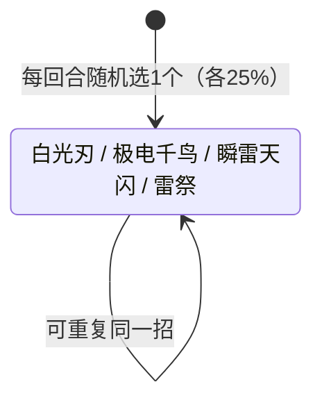

# 雷伊

## 基本信息

| 属性 | 数值 |
|---|---|
| 分类 | [Boss 怪物](/monsters/boss/) |
| 生命值 | 118 - 123 |
| 被动能力 | [雷雨天](#被动能力) |

## 行动逻辑

开局自带"雷雨天"被动（详见被动能力），4 个招式**完全随机**等概率（各 25%）选择，可连续重复同一招。

> **说明**：4 个招式纯随机（权重各 1，可连续重复同一招），没有固定顺序也没有 HP 门槛。白光刃：10 伤害（必暴）+ 驱散全属性；极电千鸟：4×3 必暴 + 每次力量 +1；瞬雷天闪：12 必暴 + 瘫痪 3 层 + 超频 3 层；雷祭：自伤 10×2 次 + 闪电球伤害。

## 招式

| 招式 | 意图 | 描述 | 数值 |
|---|---|---|---|
| 白光刃 | 白光刃 | 造成伤害。消除你所有的全属性强化（力量/防御/命中/速度正值），消除自身全属性下降（负值归零）。 | 伤害 10 |
| 极电千鸟 | 极电千鸟 | 造成伤害多次。每次造成未被格挡的伤害后，自身力量+1。 | 伤害 4 × 3 次 |
| 瞬雷天闪 | 瞬雷天闪 | 造成伤害。你获得瘫痪3层，自身获得超频3层。 | 伤害 12；瘫痪 3 层；超频 3 层 |
| 雷祭 | 雷祭 | 自身受到10点伤害2次。生成的闪电球数量等于本场战斗累计生成的闪电球数量。 | 自伤 10 × 2 次；每球 8 伤害 |

## 被动能力

### 雷雨天

雷伊加入房间时同时施加 3 个能力，共同实现"雷雨天"被动：

- **雷雨天（不可消除）**：自身攻击必定暴击。每次造成伤害（含自伤）后，闪电充能球+1。充能球伤害不触发雷雨天。
- **暴击（不可消除）**：暴击系统核心引擎，暴击伤害 1.5 倍由其处理。
- **锁定II（不可消除，实例化类型）**：自身暴击率修改为 100%。暴击系统在攻击前读取此能力强制触发暴击。

**闪电充能球系统**：开局不施加（层数为 0 时会被拦截），第一次造成伤害时由雷雨天能力施加 1 层。

- **生成**：每次造成伤害（含雷祭自伤）时 +1 球。
- **雷祭触发**：生成本场战斗累计生成数量的球，每球 8 点伤害。生成完成后累计数量 += 生成数量（即翻倍），实现"每用一次雷祭球数翻倍"的指数增长。

**防循环机制**：所有球伤害标记为充能球伤害，使伤害回调跳过生成，防止球伤害生成新球。

## 遭遇战

| 遭遇战 | 房间类型 | 池子 | 数量 | 说明 |
|---|---|---|---|---|
| `SeerRayBoss` | Boss | 第一层 | 1 只 | 第一层 Boss 怪物 |

## 攻略要点

### 暴击威胁（核心机制）

雷伊因"雷雨天"被动**每次攻击必定暴击**（伤害 ×1.5），所以面板数值只是基础值，**实际伤害比面板高 50%**：

| 招式 | 面板伤害 | 实际伤害（含暴击） |
|---|---|---|
| 白光刃 | 10 | 约 15 |
| 极电千鸟 | 4 × 3 段 | 约 6 × 3 段 = 18 |
| 瞬雷天闪 | 12 | 约 18 |

暴击只影响**有伤害的攻击招式**（白光刃/极电千鸟/瞬雷天闪），**不影响**雷祭自伤（非攻击伤害）和闪电球伤害。所以雷祭那 20 点自伤是固定的，球伤害也是固定的。

### 极电千鸟滚雪球

极电千鸟 3 段伤害，每段**造成未被格挡的伤害后**自身力量 +1。若 3 段全命中且未被格挡，雷伊获得 3 层力量，**后续所有攻击伤害 +3**（每层力量 +1 伤害）。配合必暴机制，单次极电千鸟实际总伤约 18 点，下回合白光刃变 13+15=28 左右，瞬雷天闪变 15+18=33 左右。

**应对**：开格挡挡掉伤害避免力量叠层，或用虚弱（伤害 -25%）+ 易伤反向抵消。极电千鸟连续放 2 次力量叠到 6 层后会非常痛。

### 雷祭自伤与闪电球指数增长

雷祭自伤 10 × 2 共 20 点是固定值，但会触发"雷雨天"生成 +2（自伤也算伤害）。雷祭核心威胁是**闪电球数量指数增长**：

- 第一次雷祭时累计生成数 = N（开局累计伤害次数），生成 N 个球，每球 8 伤害，然后累计数翻倍为 2N
- 第二次雷祭生成 2N 个球，每球 8 伤害，累计数变 4N
- 第三次雷祭生成 4N 个球...以此类推

雷祭纯随机出现（无 HP 门槛），连续抽到 2-3 次后闪电球总伤会从 8 上升到 16 → 32 → 64...迅速失控。**优先击杀或控制血线别拖太久**。

### 闪电球被动伤害

闪电球槽位上限 2 个（与原版 Defect 一致），每次雷伊造成伤害时 +1 球，超过 2 个时**最旧的球被激发**（对随机敌人造成 8 点伤害）。

回合结束时，每个球对**随机敌人**造成 3 点伤害。注意：

- 球伤害是非攻击伤害，**不受暴击/力量/易伤/虚弱影响**，是固定伤害
- 球伤害不触发"雷雨天"生成（防循环）
- 多人模式下随机选目标（战斗目标随机源），可能集中打一人也可能分散

### 瘫痪与超频联动（瞬雷天闪）

瞬雷天闪给玩家施加 3 层**瘫痪**，同时给雷伊自身施加 3 层**超频**：

- **瘫痪**（玩家身上）：攻击伤害固定 **-10%**（与层数无关，层数只影响持续时间），下回合开始时若上回合未造成伤害，获得虚弱+易伤+缩小各 1 层
- **超频**（雷伊自身）：每回合开始获得 1 层先制（共 3 回合），**超频移除时给雷伊自身施加 2 层瘫痪**（超频能力移除时触发，固定施加 2 层瘫痪）

**反制窗口**：超频 3 层在 3 回合后自然消失，雷伊自身会陷入 2 层瘫痪（攻击伤害固定 -10%，持续 2 回合），且每回合有概率获得虚弱+易伤+缩小。这 2 层瘫痪**不可被白光刃清除**——白光刃的属性驱散只清除力量/防御/命中/速度四属性的**负值**，不清除瘫痪（独立减益类型）。实际反制窗口比预期更长，应利用这 2 回合全力输出。

### 招式优先级与概率

4 招纯随机等概率（各 25%，可连续重复同一招），没有固定顺序也没有 HP 门槛。**最坏情况**：连续 3 回合抽到瞬雷天闪（54 总伤 + 3 回合先制）或连续 3 回合抽到雷祭（指数增长的闪电球）。**最佳情况**：连续抽到白光刃（无召唤/无debuff）。

### 推荐策略

1. **节奏取舍**：雷伊血量 118-123 不算高，但暴击机制让 DPS 需求翻倍。雷祭累计生成数指数增长，超过 3 次雷祭后闪电球伤害可能直接秒杀。
   - **爆发牌组**：优先速战，避免拖延到雷祭指数增长阶段
   - **续航牌组**：无法速战时，等超频 3 层自然消失后的 2 层瘫痪反制窗口（约第4-5回合），趁雷伊攻击伤害-10%时输出。同时用虚弱降低暴击基础值
2. **保留格挡**：极电千鸟 3 段每段都需独立格挡，瞬雷天闪 12 单段高伤需重格挡
3. **虚弱是关键减伤**：虚弱让雷伊攻击伤害 -25%，可大幅降低暴击伤害（暴击仍触发但基础值降低）
4. **清除超频窗口**：若战局拉长，等超频 3 层自然消失后的 2 层瘫痪反制窗口，趁机输出
5. **避免长线作战**：雷祭累计生成数指数增长，超过 3 次雷祭后闪电球伤害可能直接秒杀

## 小贴士

- 雷伊每次攻击必定暴击，实际伤害比面板高50%，注意格挡高伤招式。
- 速战速决，雷祭连续使用会导致闪电球数量指数增长，拖久了会被秒杀。

## 源码

- `SeerRayMonster.cs`
- `SeerRainstormPower.cs`、`SeerCriticalStrikePower.cs`、`SeerLockTwoPower.cs`、`SeerLightningOrbCounterPower.cs`、`SeerOverclockPower.cs`、`SeerParalysisPower.cs`
- 遭遇战：`SeerRayBoss.cs`
- 本地化：`monsters.json`、`intents.json`、`powers.json`