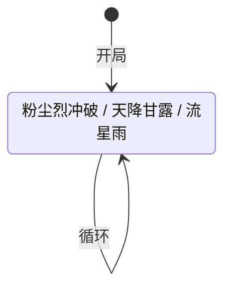

# 魔狮迪露

> **类型**：精英怪物
> **初始生命**：999998 - 1000003（约 100 万）
> **遭遇战**：第二层精英池
> **特性**：镜影术（受到伤害 ×1000） + 缓慢（每打一张牌 +10% 攻击伤害） + 速度 -5（玩家多抽 2 张牌）——三重被动形成"多抽多打速杀"的独特节奏

## 被动能力（开局自带）

| 名称 | 类型 | 效果 |
|------|------|------|
| **[镜影术](/powers/mirror_image_power.md)**（1 层） | 能力（不可消除） | 自身受到的所有伤害 ×1000。自身回合结束时，若当前生命 ≤ 最大生命的 10%，获得 20 层[狂暴](/powers/fury_power.md) |
| **缓慢**（1 层） | Debuff（原版） | 玩家本回合每打出一张牌，魔狮迪露本回合从攻击牌受到的伤害 +10%（魔狮迪露回合开始时重置计数） |
| **[速度](/powers/speed_power.md)** -5 | Debuff | 魔狮迪露速度 -5。因怪物持有负层速度，效果反转为：所有玩家每回合 多抽 2 张牌（怪物速度 -5 → 玩家抽牌数 +2） |

::: warning 三重被动的联动机制
魔狮迪露的三个被动形成了一套精妙的"速杀"设计：

1. **镜影术**让有效生命从 100 万降至约 1000（100 万 ÷ 1000）
2. **缓慢**让玩家每打出一张牌，攻击伤害额外 +10%，与镜影术的 ×1000 **相乘**结算
3. **速度 -5**让玩家每回合多抽 2 张牌，提供更多出牌机会来叠加缓慢倍率

**最终伤害公式**：原始伤害 × 1000 × (1 + 0.1 × 本回合已打牌数)

举例：一回合打出 5 张攻击牌，每张造成 6 点原始伤害：
- 第 1 张：6 × 1000 × 1.0 = 6000
- 第 2 张：6 × 1000 × 1.1 = 6600
- 第 3 张：6 × 1000 × 1.2 = 7200
- 第 4 张：6 × 1000 × 1.3 = 7800
- 第 5 张：6 × 1000 × 1.4 = 8400
- **合计**：36000，远超 1000 有效生命，单回合即可击杀
:::

## 行动逻辑

开局自带三被动后，每回合 3 选 1 随机出招（可重复）。

> **说明**：`/` 表示三选一随机出招，每招可连续重复。

## 招式表

| 招式名 | 意图 | 类型 | 效果 |
|--------|------|------|------|
| **粉尘烈冲破** | 攻击 15 | 攻击 + 自身强化 | 造成 15 点攻击伤害；自身[力量](/powers/strength_power.md) +1 |
| **天降甘露** | 天降甘露 | 全属性削弱 | 所有敌方目标的[力量](/powers/strength_power.md)/[防御](/powers/defense_power.md)/[命中](/powers/accuracy_power.md)/[速度](/powers/speed_power.md) 各 -1 |
| **流星雨** | 攻击 4 ×2 | 多段攻击 + 固定伤害 | 造成 4 点攻击伤害 ×2 次；所有敌方目标附加 10 点[固定伤害](/powers/fixed_damage_power.md)（下回合开始时结算） |

::: tip 招式威胁分析
- **粉尘烈冲破**：15 点直接攻击伤害，配合力量增长会越打越痛。但 15 点在镜影术的速杀节奏下基本不是威胁——你应该在 1~2 回合内就解决战斗
- **天降甘露**：全属性 -1 会削弱你的输出和命中，长期战不利。但同样地，速杀节奏下影响有限
- **流星雨**：4×2 = 8 点攻击伤害 + 10 点固定伤害。固定伤害无法格挡，下回合开始时结算，是唯一能绕过格挡的威胁
:::

## 低血狂暴机制

镜影术的第二个效果：魔狮迪露自身回合结束时，若当前生命 ≤ 最大生命值的 10%（即 ≤ 100000），获得 20 层[狂暴](/powers/fury_power.md)。

- **狂暴效果**：每层攻击伤害 +25%，回合结束减 1 层
- **触发条件**：血量 ≤ 10%（约 10 万血），即有效生命剩 ≤ 100（10 万 ÷ 1000）
- **风险**：若未能一回合击杀且将血量压到 10% 以下，下回合魔狮迪露获得 20 层狂暴，输出暴涨
- **应对**：要么在触发狂暴前一次性溢出伤害斩杀，要么保持血量健康硬扛狂暴后的爆发

## 遭遇战

| 遭遇战 | 房间类型 | 池子 | 数量 | 说明 |
|--------|----------|------|------|------|
| `SeerMojjElite` | Elite | 第二层精英池 | 1 只 | 单怪物精英 |

## 策略提示

1. **有效生命约 1000，不是 100 万**：镜影术让受到伤害 ×1000，100 万血量等效约 1000 有效生命。普通攻击即可快速削减，不需要特殊机制。

2. **多抽 2 张牌是核心优势**：速度 -5 让玩家每回合多抽 2 张牌。配合缓慢（每打一张牌 +10% 攻击伤害），多抽牌 = 多打牌 = 缓慢倍率更高 = 伤害更高。一回合打出 5~6 张攻击牌即可击杀。

3. **缓慢倍率与镜影术相乘**：最终伤害 = 原始伤害 × 1000 × (1 + 0.1 × 已打牌数)。第 1 张牌就是 ×1000，第 5 张牌是 ×1400，第 10 张牌是 ×2000。尽量在单回合内多打攻击牌，最大化缓慢倍率。

4. **缓慢只对攻击伤害生效**：缓慢的 +10% 倍率仅对攻击伤害生效，固定伤害和流失伤害不受缓慢加成。但镜影术的 ×1000 对所有伤害类型生效。因此攻击牌收益最高（享受双重加成），固定伤害次之（仅 ×1000）。

5. **避免拖入低血狂暴**：若血量被压到 10% 以下（有效生命 ≤ 100）但未能击杀，下回合魔狮迪露获得 20 层狂暴，攻击伤害暴涨。建议一次性溢出伤害斩杀，不要"打残等下回合"。

6. **流星雨的固定伤害无法格挡**：流星雨附加 10 点固定伤害，下回合开始时结算，格挡无效。但 10 点固定伤害在玩家血量健康时影响不大，速杀节奏下可忽略。

7. **天降甘露削弱全属性**：天降甘露让力量/防御/命中/速度各 -1。速度 -1 会让你少抽牌（与魔狮迪露的速度 -5 部分抵消），命中 -1 会降低攻击命中率。但单次 -1 影响有限，速杀节奏下不必过于担心。

8. **一回合击杀是最佳策略**：多抽 2 张牌 + 缓慢倍率 + 镜影术 ×1000，一回合打出 5~6 张攻击牌即可击杀。拖到第 2 回合反而可能因天降甘露削弱属性或流星雨固定伤害而增加变数。

## 源码

- `SeerMojjMonster.cs`
- `SeerMirrorImagePower.cs`、`SlowPower.cs`、`SeerSpeedPower.cs`、`SeerFuryPower.cs`
- 遭遇战：`SeerMojjElite.cs`（第二层精英池，单怪物）
- 本地化：`monsters.json`（`SEER_MONSTER_SEER_MOJJ_MONSTER.*`）、`intents.json`（`SEER_DUST_RUSH.*`、`SEER_HEAVENLY_DEW.*`、`SEER_METEOR_SHOWER.*`）、`powers.json`（`SEER_POWER_SEER_MIRROR_IMAGE_POWER.*`、`SLOW_POWER.*`、`SEER_POWER_SEER_SPEED_POWER.*`、`SEER_POWER_SEER_FURY_POWER.*`）
