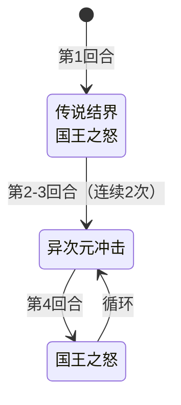

# 史莱姆国王

## 基本信息

| 属性 | 数值 |
|---|---|
| 分类 | [普通怪物](/monsters/normal/) |
| 生命值 | 158 - 163 |
| 被动能力 | [无尽幻象](#被动能力)（1 层） |

## 行动逻辑

首回合使用组合招式「传说结界·国王之怒」（双意图），随后按「异次元冲击 ×2 → 国王之怒」循环。

> **说明**：双招换行显示。

## 招式

| 招式 | 意图 | 描述 | 数值 |
|---|---|---|---|
| 异次元冲击 | 异次元冲击 | 造成15点伤害，附加等于你消耗牌堆状态牌数的固定伤害。 | 伤害 15，固定伤害 = 消耗堆状态牌数 |
| 传说结界 | 传说结界 | 免疫异常状态和能力下降。施加闪光漩涡。 | 自身传说结界 1 层，敌方闪光漩涡 1 层 |
| 国王之怒 | 国王之怒 | 升级所有黏液？。3回合内，每回合开始向你的抽牌堆加入2张黏液？。 | 持续 3 回合，每回合加 2 张黏液？ |
| 传说结界·国王之怒 | 传说结界 + 国王之怒 | 首回合组合招式，依次执行传说结界与国王之怒。 | 同上两项 |

## 被动能力

### 无尽幻象（1 层）

死亡时分裂为2只史莱姆。

- **初始层数**：1（怪物加入房间时施加）。
- **触发机制**：国王死亡时，等待死亡动画播放完毕后，召唤 2 只史莱姆到场景预留的槽位。
- **阻止战斗结束**：分裂召唤动画完成前会阻止战斗提前结束。
- **能力类型**：不可消除（不被消除 buff/debuff 类效果清除）。

## 相关能力说明

- **传说结界**：免疫异常状态和能力下降。
- **闪光漩涡**：每回合结束时，若你的四个牌堆（抽牌/手牌/弃牌/消耗）都有状态牌，战斗结束后向你的牌组加入一张粘液。
- **固定伤害**：在你的回合开始时受到等于层数的固定伤害后移除（由异次元冲击施加）。
- **黏液？**：状态牌，被国王之怒/能量震波升级后会增强。

## 遭遇战

| 遭遇战 | 房间类型 | 池子 | 数量 | 说明 |
|---|---|---|---|---|
| `SeerSlimeKingStrongEncounter` | Monster | 强怪池 | 1 只 | 单国王，预留分裂槽位 |
| `SeerSlimePrinceDoubleKingWeakEncounter` | Monster | 弱怪池 | 1 只 | 与 2 只史莱姆王子同行 |

## 策略提示

1. **首回合双招爆发是最大威胁**：第 1 回合即同时执行「传说结界」+「国王之怒」——传说结界让国王永久免疫异常状态和能力下降（无法用中毒/烧伤/虚弱等异常削弱），国王之怒立即升级所有黏液？并启动 3 回合黏液污染（每回合开始向抽牌堆加入 2 张黏液？）。开局就要面对 6 张黏液？污染抽牌堆 + 国王免疫所有异常的双重压力。

2. **异次元冲击的固定伤害**：异次元冲击造成 15 点攻击伤害 + 等于你消耗牌堆中状态牌数量的[固定伤害](/mechanics/fixed-damage)。消耗堆中每有一张状态牌（如黏液？、煤灰、杂音等被消耗的状态牌），固定伤害 +1。避免在战斗中大量消耗状态牌可降低固定伤害。国王之怒塞的黏液？如果不被消耗，不会增加固定伤害——但黏液？会堵塞手牌和抽牌堆。

3. **分裂出 11 万血史莱姆**：国王死亡后分裂出 2 只 11 万+ 血的史莱姆，硬杀不现实。分裂出的史莱姆会使用「史莱姆意志」在第 2 回合变身为随机变种史莱姆（攻击/防御/体力/速度，各 1/4 概率），变身后血量降至 32~105。应利用变身机制——等分裂出的史莱姆变身后击杀新变种，而非硬打 11 万血的本体。

4. **传说结界免疫异常**：传说结界使国王永久免疫攻击/防御/命中/速度/虚弱/易伤/燃烧/冻伤/冰封/中毒的负层数。无法用异常状态削弱，必须依靠直接伤害或[固定伤害](/mechanics/fixed-damage)。但国王本身没有格挡或硬化外壳，直接攻击伤害有效。

5. **国王之怒的黏液升级**：国王之怒会立即升级你已有的所有黏液？，使其威胁升级。同时启动 3 回合效果——每回合开始向抽牌堆加入 2 张黏液？。3 回合共塞入 6 张黏液？到抽牌堆，严重污染抽牌节奏。应及时处理手中的黏液？（打出或消耗），避免抽牌堆被堵塞。

6. **闪光漩涡的潜伏威胁**：传说结界向你施加闪光漩涡——每回合结束时，若你的四个牌堆（抽牌/手牌/弃牌/消耗）都有状态牌，战斗结束后向你的牌组加入一张粘液。国王之怒塞的黏液？会满足"抽牌堆有状态牌"的条件，如果你的手牌和弃牌堆也有状态牌，闪光漩涡就会触发。及时清理状态牌可避免牌组被长期污染。

7. **循环节奏可预判**：首回合传说结界+国王之怒，之后按「异次元冲击 ×2 → 国王之怒」循环。异次元冲击回合需准备 15+ 格挡（加上消耗堆状态牌数的固定伤害），国王之怒回合不直接造成伤害但会塞黏液？。根据循环节奏分配格挡和输出资源。

8. **158~163 血需要 3~4 回合击杀**：国王血量在普通怪物中偏高，配合传说结界免疫异常和分裂机制，实际战斗时间会更长。但国王本身没有格挡/硬化外壳/无实体等防御能力，直接攻击伤害全程有效。集中火力在分裂前击杀本体可避免分裂出 2 只史莱姆的后续麻烦——但 158~163 血在 3~4 回合内击杀需要较强的爆发能力。

## 源码

- `SeerSlimeKingMonster.cs`
- `SeerEndlessIllusionPower.cs`
- `SeerLegendaryBarrierPower.cs`、`SeerFlashVortexPower.cs`、`SeerFixedDamagePower.cs`
- 卡牌：`SeerSlimeQuest.cs`
- 遭遇战：`SeerSlimeKingStrongEncounter.cs`、`SeerSlimePrinceDoubleKingWeakEncounter.cs`
- 本地化：`monsters.json`（`SEER_MONSTER_SEER_SLIME_KING_MONSTER.*`）、`intents.json`（`SEER_DIMENSION_IMPACT.*`、`SEER_LEGENDARY_BARRIER.*`、`SEER_KINGS_WRATH.*`）、`powers.json`（`SEER_POWER_SEER_ENDLESS_ILLUSION_POWER.*`、`SEER_POWER_SEER_LEGENDARY_BARRIER_POWER.*`、`SEER_POWER_SEER_FLASH_VORTEX_POWER.*`、`SEER_POWER_SEER_FIXED_DAMAGE_POWER.*`）
